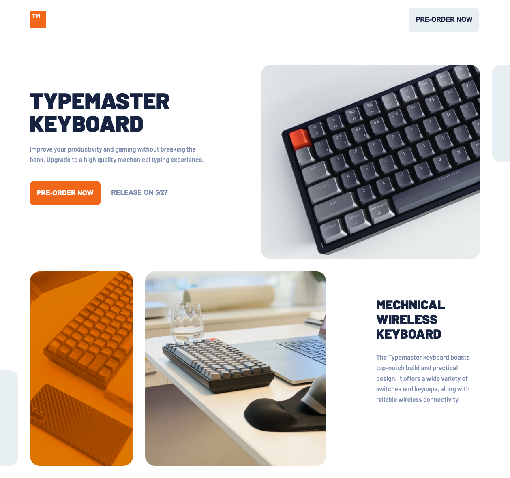

# Frontend Mentor - Typemaster pre-launch landing page solution

This is a solution to the [Typemaster pre-launch landing page challenge on Frontend Mentor](). Frontend Mentor challenges help you improve your coding skills by building realistic projects.

## Table of contents

- [Frontend Mentor - Typemaster pre-launch landing page solution](#frontend-mentor---typemaster-pre-launch-landing-page-solution)
  - [Table of contents](#table-of-contents)
  - [Overview](#overview)
    - [The challenge](#the-challenge)
    - [Screenshot](#screenshot)
    - [Links](#links)
  - [My process](#my-process)
    - [Built with](#built-with)
  - [Author](#author)

## Overview

### The challenge

Users should be able to:

- View the optimal layout depending on their device's screen size
- See hover states for interactive elements

### Screenshot

### Links

- Solution URL: [https://github.com/KINZ-UP/Typemaster-landing-page](https://github.com/KINZ-UP/Typemaster-landing-page)
- Live Site URL: [https://kinz-up.github.io/Typemaster-landing-page](https://kinz-up.github.io/Typemaster-landing-page/)

## My Process

### Built with

- Pure HTML & CSS

## Author

- Website - [http://blog.kinzup.com/](http://blog.kinzup.com/)
- Frontend Mentor - [@Zero-Nine](https://www.frontendmentor.io/profile/KINZ-UP)
